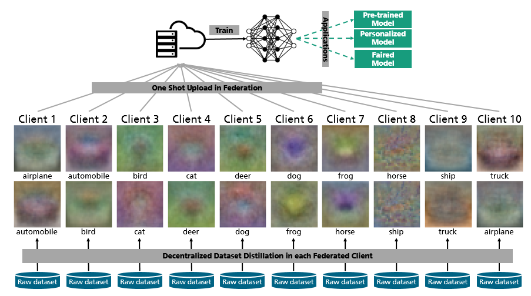
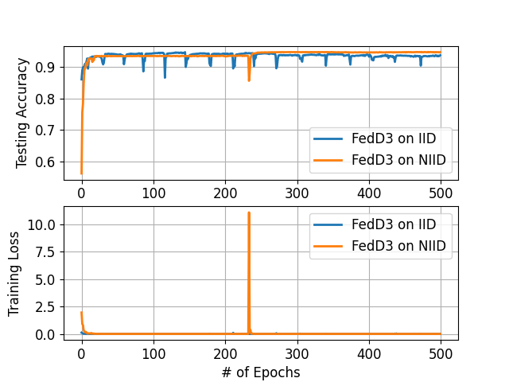
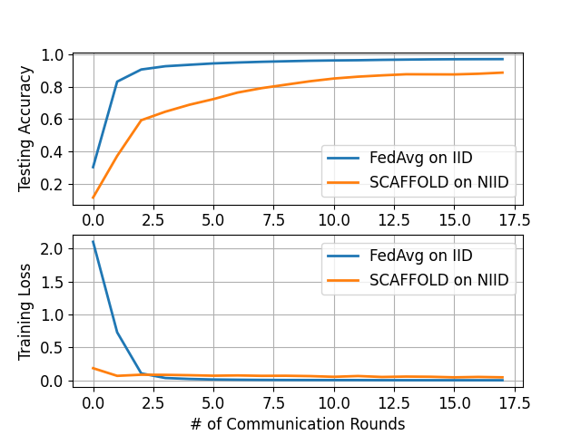

# Federated Learning via Decentralized Dataset Distillation in Resource-Constrained Edge Environments

[](https://arxiv.org/abs/2208.11311)
[](https://arxiv.org/abs/2208.11311)

## Introduction

FedD3 is a federated learning framework designed to train models using decentralized dataset distillation, requiring only a single communication round. This repository contains four main modules:

* **Dataset preprocessing**: Splits the dataset into a number of clients according to federated settings.
* **FedD3 implementation**: PyTorch implementation of FedD3 with coreset-based and KIP-based instances.
* **Baseline implementations**: PyTorch implementations of federated learning baselines, including FedAvg, FedNova, FedProx, and SCAFFOLD.
* **Postprocessing**: Visualizes training results for evaluation.

## Framework Overview




## Installation

### Dependencies

 - Python (3.8)
 - PyTorch (1.8.1)
 - sklearn (0.24.2)
 - OpenCV (4.5)
 - numpy (1.21.5)
 - neural-tangents (0.6.0)
 - jaxlib (0.3.7)

### Install requirements

Run the following command to install the required packages:

`pip install -r requirements.txt` 

## Federated Dataset Preprocessing

This module divides the entire dataset into a specified number of clients based on federated settings. Non-IID datasets are created depending on the value of C_k (the number of classes in each local dataset) to introduce label distribution skew.

By calling the divide_data() function, one of the datasets used in this paper (i.e., MNIST, CIFAR-10, Fashion-MNIST, and SVHN) is automatically downloaded via PyTorch. This module is integrated into the main functions of FedD3 and baselines.

## Running FedD3

### Test Run

```
python fedd3_main.py -nc 500 \
                     -ck 10 \
                     -ds 'MNIST' \
                     -md 'LeNet' \
                     -is 0 \
                     -rr 'results' \
                     -sne 500 \
                     -sbs 50 \
                     -slr 0.001 \
                     -smt 0.9 \
                     -snw 1 \
                     -cis 'kip_distill'\
                     -cnd 10 \
                     -cil 0.004 \
                     -cib 10 \
                     -cie 3000 \
                     -cit 0.999
```

### Explanations of Arguments

- `--sys-n_client` `-nc`: Number of clients
- `--sys-n_local_class` `-ck`: Number of classes in each client
- `--sys-dataset` `-ds`: Dataset name (one of "MNIST", "CIFAR-10", "FashionMnist", "SVHN", or "CIFAR100")
- `--sys-model` `-md`: Model name (e.g., "LeNet" for MNIST, "AlexCifarNet" for CIFAR-10, "CNN" for CIFAR-100)
- `--sys-i_seed` `-is`: Seed used in experiments
- `--sys-res_root` `-rr`: Root directory of results
  

- `--server-n_epoch` `-sne`: Number of server training epochs
- `--server-bs` `-sbs`: Server batch size
- `--server-lr` `-slr`: Server learning rate
- `--server-momentum` `-smt`: Server momentum
- `--server-n_worker` `-snw`: Number of server workers
  

- `--client-instance` `-cis`: Instance used in clients ("kip_distill", "herding", etc.)
- `--client-n_dd` `-cnd`: Number of distilled images in clients
- `--client-instance_lr` `-cil`: Client learning rate
- `--client-instance_bs` `-cib`: Client batch size
- `--client-instance_max_n_epoch` `-cie`: Maximum number of client epochs
- `--client-instance_threshold` `-cit`: Dataset distillation accuracy threshold for clients

### Examples 

* **Examples I** Run FedD3 on IID MNIST with 500 clients:
`python fedd3_main.py -nc 500 -ck 10 -ds 'MNIST' -md 'LeNet' -is 0 -rr 'results' 
-sne 500 -sbs 50 -slr 0.001 -smt 0.9 -snw 1 -cis 'kip_distill' -cnd 10 -cil 0.004 -cib 10 -cie 3000 -cit 0.999`


* **Examples II** Run FedD3 on Non-IID MNIST with 500 clients:
`python fedd3_main.py -nc 500 -ck 2 -ds 'MNIST' -md 'LeNet' -is 0 -rr 'results' 
-sne 500 -sbs 50 -slr 0.001 -smt 0.9 -snw 1 -cis 'kip_distill' -cnd 2 -cil 0.004 -cib 10 -cie 3000 -cit 0.999`
  

* **Results**



## Running Federated Learning Baselines

### Test Run

```
python baselines_main.py -nc 10 \
                         -ck 10 \
                         -ds 'MNIST' \
                         -md 'LeNet' \
                         -is 0 \
                         -rr 'results' \
                         -nr 500 \
                         -os 1\
                         -cis 'FedAvg' \
                         -cil 0.001 \
                         -cib 50 \
                         -cie 1 \
                         -sim 0.9 \
                         -sin 1
```


### Explanations of Arguments

- `--sys-n_client` `-nc`: Number of clients
- `--sys-n_local_class` `-ck`: Number of classes in each client
- `--sys-dataset` `-ds`: Dataset name (one of "MNIST", "CIFAR10", "FashionMnist", "SVHN", or "CIFAR100")
- `--sys-model` `-md`: Model name
- `--sys-i_seed` `-is`: Seed used in experiments
- `--sys-res_root` `-rr`: Root directory of the results
- `--sys-n_round` `-nr`: Number of global communication rounds
- `--sys-oneshot` `-os`: True for one-shot communication; otherwise, False
  

- `--client-instance` `-cis`: Federated learning algorithm instance used in clients ("FedAvg", "SCAFFOLD", "FedNova", or "FedProx")
- `--client-instance_lr` `-cil`: Client learning rate
- `--client-instance_bs` `-cib`: Client batch size
- `--client-instance_n_epoch` `-cie`: Number of local training epochs in clients
- `--client-instance_momentum` `-sim`: Client momentum
- `--client-instance_n_worker` `-sin`: Number of server workers

### Examples

* **Example III** Run: `python baselines_main.py -nc 500 -ck 10 -ds 'MNIST' -md 'LeNet' -is 0 -rr 'results' 
-nr 18 -cis 'FedAvg' -cil 0.001 -cib 50 -cie 50 -sim 0.9 -sin 1`

* **Example IV** Run SCAFFOLD on Non-IID MNIST with 500 clients:
Run: `python baselines_main.py -nc 500 -ck 2 -ds 'MNIST' -md 'LeNet' -is 0 -rr 'results' 
-nr 18 -cis 'SCAFFOLD' -cil 0.001 -cib 50 -cie 50 -sim 0.9 -sin 1`

* **Results**



## Evaluation Procedures

To plot the testing accuracy and training loss over epochs or communication rounds, run:

`python postprocessing/eval_main.py -rr 'results'`

Note that the labels in the figure correspond to the names of the result files.

## Citation
 ```bibtex
@article{song2022federated,
  title={Federated learning via decentralized dataset distillation in resource-constrained edge environments},
  author={Song, Rui and Liu, Dai and Chen, Dave Zhenyu and Festag, Andreas and Trinitis, Carsten and Schulz, Martin and Knoll, Alois},
  journal={arXiv preprint arXiv:2208.11311},
  year={2022}
}
```

## Acknowledgement
For the evaluation of baseline models, we utilized the PyTorch implementations found in the [pytorch_federated_learning](https://github.com/rruisong/pytorch_federated_learning) repository.


